# Arbor Webhooks Listener

## Dependencies
```
python 3.11.4
redis 7.2.0
```

## Deployment

#### 1. Add data to local storages

```shell
vim app/data/credentials.json 
vim docker/docker-iptables.sh
cp -r <path_to_your_certfile>/ssl_certfile.crt <path_to_your_keyfile>/ssl_keyfile.key app/certs
```

#### 2. Prepare drop-in Docker logic
```shell
$ ln -s docker/docker-iptables.sh /etc/docker/docker-iptables.sh
$ ln -s docker/restart-docker-iptables.conf /etc/systemd/system/docker.service.d/restart-docker-iptables.conf

$ systemctl daemon-reload

$ systemctl restart docker
```

#### 3. Running  

```shell
$ docker compose -f docker/docker-compose.yml build
$ docker compose -f docker/docker-compose.yml up -d
$ docker compose -f docker/docker-compose.yml logs -f
```

## Webhooks Processing Schema

